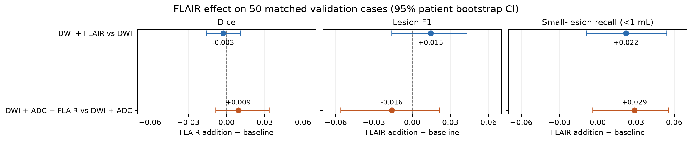

# ISLES'22 검증 50건의 병변 단위 평가

## 평가 설정

- 동일한 환자 50명에 대한 네 모델의 fold 0 검증 예측을 비교했다.
- 26-연결 병변이 예측과 한 voxel이라도 겹치면 발견으로 계산했다. 이 병변 F1 규칙은 ISLES'22 공식 평가 코드와 일치한다.
- 본 평가의 Dice는 정답과 예측이 모두 비면 1로 계산한다(ISLES'22 공식 코드 기본값). 기존 nnU-Net 요약은 그 사례를 평균에서 제외한다.
- 작은 병변: 정답 병변 구성요소 부피 < 1 mL. 이 기준과 recall은 본 프로젝트의 추가 탐색 지표다.
- HD95: 양방향 표면 거리(mm)를 합친 뒤 95번째 백분위수. 한쪽 마스크만 비어 있으면 정의되지 않아 평균에서 제외한다.
- 95% 구간은 환자 단위 paired bootstrap 10,000회, seed 2026으로 계산했다.
- 값은 내부 검증 결과이며 ISLES'22 비공개 공식 테스트 점수가 아니다.

## 네 모델의 결과

| 입력 | Dice, 빈 마스크=1 ↑ | 기존 nnU-Net Dice ↑ | 병변 F1 ↑ | 작은 병변 recall ↑ | HD95 mm ↓ | 부피 오차 mL ↓ | 발견 병변 / 505 | 거짓 양성 병변 |
|---|---:|---:|---:|---:|---:|---:|---:|---:|
| DWI | 0.7700 | 0.7653 | 0.7140 | 0.4668 (211/452) | 7.49 | 10.50 | 261 | 50 |
| DWI+ADC | 0.7619 | 0.7571 | 0.7242 | 0.4757 (215/452) | 7.73 | 9.99 | 265 | 34 |
| DWI+FLAIR | 0.7674 | 0.7626 | 0.7286 | 0.4889 (221/452) | 8.14 | 12.06 | 271 | 41 |
| DWI+ADC+FLAIR | 0.7712 | 0.7665 | 0.7083 | 0.5044 (228/452) | 8.77 | 10.98 | 278 | 54 |

## FLAIR 추가의 같은 환자 비교

| 비교 | 평균 Dice 차이 (95% 구간) | 평균 병변 F1 차이 (95% 구간) | 작은 병변 recall 차이 (95% 구간) |
|---|---:|---:|---:|
| DWI+FLAIR − DWI | -0.0026 [-0.0158, +0.0109] | +0.0146 [-0.0160, +0.0430] | +0.0221 [-0.0088, +0.0541] |
| DWI+ADC+FLAIR − DWI+ADC | +0.0092 [-0.0086, +0.0334] | -0.0160 [-0.0560, +0.0212] | +0.0288 [-0.0041, +0.0554] |
| DWI+ADC+FLAIR − DWI | +0.0012 [-0.0138, +0.0165] | -0.0058 [-0.0454, +0.0318] | +0.0376 [+0.0033, +0.0601] |



| 비교 | HD95 평균 차이 mm (95% 구간) | 부피 오차 평균 차이 mL (95% 구간) |
|---|---:|---:|
| DWI+FLAIR − DWI | -0.23 [-1.0459, +0.4147] (공통 정의 49명) | +1.56 [+0.1362, +4.0401] |
| DWI+ADC+FLAIR − DWI+ADC | +0.16 [-1.1496, +1.6186] (공통 정의 49명) | +1.00 [-0.9492, +3.2960] |

## 이번 자료가 말하는 것

DWI에 FLAIR를 추가한 비교와 DWI+ADC에 FLAIR를 추가한 비교 모두에서 Dice·병변 F1·작은 병변 recall 차이의 환자 단위 bootstrap 95% 구간이 0을 포함한다. 따라서 이번 한 번의 검증에서는 FLAIR가 일관되게 이롭거나 해롭다는 근거가 충분하지 않다.

DWI+ADC+FLAIR와 DWI의 작은 병변 recall 차이는 양수였지만, 이 비교는 ADC와 FLAIR가 동시에 달라진다. 그 차이를 FLAIR 단독 효과로 해석할 수 없다. 또한 한 voxel만 겹쳐도 병변 검출로 계산하는 공식 F1 규칙은 경계 품질까지 보장하지 않는다.

DWI+ADC에 FLAIR를 추가한 모델은 정답 병변을 더 많이 발견했지만 거짓 양성 병변도 증가했다. 따라서 발견률만 보고 모델을 선택하면 과잉 예측을 놓칠 수 있다.

DWI+FLAIR는 DWI보다 평균 절대 병변 부피 오차가 1.56 mL 컸다. 환자 단위 bootstrap 95% 구간은 0보다 컸지만, 여러 지표를 탐색한 한 번의 내부 검증 결과로 해석해야 한다.

95% 구간이 0을 포함하면 이번 검증 자료만으로는 변화 방향이 안정적이라고 보기 어렵다. 구간이 0을 벗어나더라도 한 번의 200/50 분할에서 얻은 탐색 결과이며, 외부 데이터 일반화의 증거는 아니다.

## 재현

```bash
python scripts/evaluate_validation.py
python scripts/plot_flair_ablation.py
```

환자별 결과는 공개 저장소에 올리지 않는 `reports/detailed_evaluation/per_case_private.csv`에 저장된다.

공식 평가 코드: <https://github.com/ezequieldlrosa/isles22/blob/main/utils/eval_utils.py>
